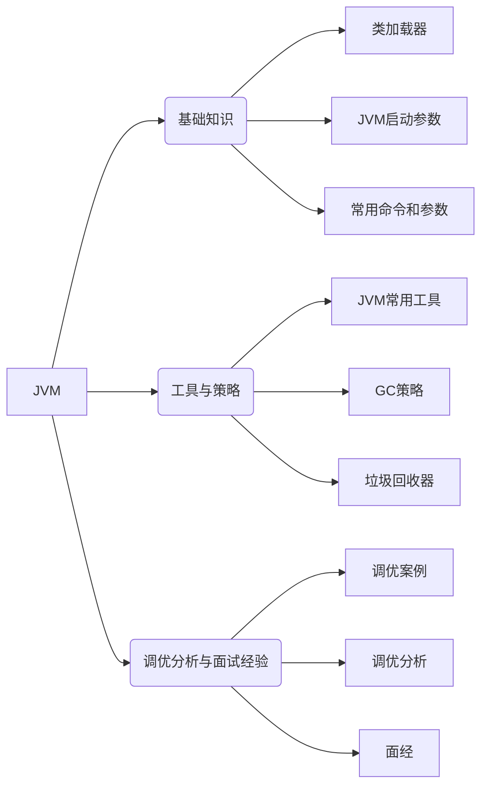

```mermaid
graph LR
A[JVM] --> B(基础知识)
A[JVM] --> C(工具与策略)
A[JVM] --> D(调优分析与面试经验)

B --> BC[类加载器]
B --> BD[JVM启动参数]
B --> BE[常用命令和参数]

C --> CA[JVM常用工具]
C --> CB[GC策略]
C --> CC[垃圾回收器]

D --> DA[调优案例]
D --> DB[调优分析]
D --> DC[面经]
```