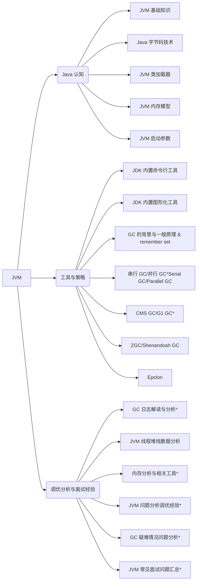

github 上展示, 只需安装对应插件即可,

```mermaid
graph LR
A[JVM] --> B( Java 认知)
A[JVM] --> C(工具与策略)
A[JVM] --> D(调优分析与面试经验)

B --> BC[ JVM 基础知识]
B --> BD[ Java 字节码技术]
B --> BE[ JVM 类加载器]
B --> BF[ JVM 内存模型]
B --> BG[ JVM 启动参数]

C --> CA[ JDK 内置命令行工具]
C --> CB[ JDK 内置图形化工具]
C --> CC[ GC 的背景与一般原理 & remember set]
C --> CD[串行 GC/并行 GC*Serial GC/Parallel GC]
C --> CE[ CMS GC/G1 GC* ]
C --> CF[ ZGC/Shenandoah GC ]
C --> CGs[ Epclon ]

D --> DA[GC 日志解读与分析*]
D --> DB[JVM 线程堆栈数据分析]
D --> DC[内存分析与相关工具*]
D --> DD[JVM 问题分析调优经验*]
D --> DE[GC 疑难情况问题分析*]
D --> DF[JVM 常见面试问题汇总*]

```